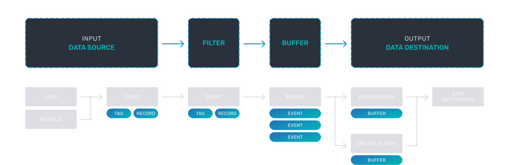

# Fluentbit

## Pipeline

### Event or Record
Every incoming piece of data that belongs to a log or a metric that is retrieved by FluentBit is considered an Event or a Record.

As an example consider the following content of a Syslog file:

```
Jan 18 12:52:16 flb systemd[2222]: Starting GNOME Terminal Server
Jan 18 12:52:16 flb dbus-daemon[2243]: [session uid=1000 pid=2243] Successfully activated service 'org.gnome.Terminal'
Jan 18 12:52:16 flb systemd[2222]: Started GNOME Terminal Server.
Jan 18 12:52:16 flb gsd-media-keys[2640]: # watch_fast: "/org/gnome/terminal/legacy/" (establishing: 0, active: 0)
```

It contains four lines and all of them represents four independent Events.

Internally, an Event always has two components (in an array form):

```
[TIMESTAMP, MESSAGE]
```

### Filtering
In some cases it is required to perform modifications on the Events content, the process to alter, enrich or drop Events is called Filtering.

Filtering means 3 general cases:
*  Append specific information to an Event like an IP address or metadata.
*  Select a specific piece of the Event content.
*  Drop Events that matches certain pattern.

### Tag
Every Event gets into Fluent Bit gets assigned a Tag. This tag is an internal string that is used in a later stage by the Router to decide wich Filter or Output phase it must go through.

Most of the tags are assigned manually in the configuration. If a tag is not specified, Fluent Bit will assign the name of the Input plugin instance form where that Event was generated from.

> The only input plugin that does NOT assign tags is Forward input.

A tagged record must always have a Matching rule.

### Timestamp
The Timestamp represents the time when an Event was created. Every Event contains a Timestamp associated. The Timestamp is a numeric fractional integer in the format:

```
SECONDS.NANOSECONDS
```

Seconds is the number of seconds that have elapsed since the Unix epoch.

### Match
Fluent Bit allows to deliver your collected and processed Events to one or multiple destinations, this is done through a routing phase. A Match represent a simple rule to select Events where it Tags matches a defined rule.

### Structured Messages
Source events can have or not have a structure. A structure defines a set of keys and values inside the Event message. As an example consider the following two messages:

Unstructured Message:
```
"Project Fluent Bit created on 1398289291"
```

Structured Message:
```
{"project": "Fluent Bit", "created": 1398289291}
```

At a low level both are just an array of bytes, but the Structured message defines keys and values, having a structure helps to implement faster operations on data modifications.

> Fluent Bit always handles every Event message as a structured message. For performance reasons, we use a binary serialization data format called MessagePack. Consider it a binary version of JSON on steroids.


### Buffering
When FluentBit processes data, it uses the system memory (heap) as a primary and temporary place to store the record logs before they get delivered, in this private memory area the records are processed.

Buffering refers to the ability to store the records somewhere, and while they are processed and delivered, still be able to store more. Buffering in memory is the fastest mechanism, but there are certain scenarios where it requires special strategies to deal with backpressure, data safety or reduce memory consumption by the service in constrained environments.

> Network failures or latency on third party service is pretty common, and on scenarios where we cannot deliver data fast enough as we receive new data to process, we likely will face backpressure.

Fluent Bit as buffering strategies go, offers a primary buffering mechanism in memory and an optional secondary one using the file system. With this hybrid solution you can accomodate any use case safely and keep a high performance while processing your data.

Both mechanisms are not mutally exclusive and when the data is ready to be processed or delivered it will always be in memory, while other data in the queue might be in the file system until is ready to be processed and moved up to memory.