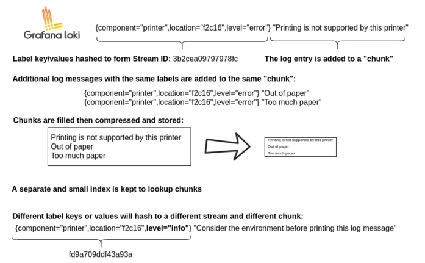

# Loki
Loki is build around the idea of **only** indexing metadata about your logs: labels (like Prometheus labels). Log data itself is then compressed and stored in chunks in object stores such S3 or GC, or even locally on the filesystem.

**Loki index is built from labels, leaving the original log message unindexed.**, meanwhile logs are stored in plaintext form tagged with a set of those label names and values.

However, because of this tradeoff, LoqQL queries that filter based on content (i.e., text whithin the log lines) require loading all chunks within the search window that match the labels defined in the query.

## Features

1. Efficient memory usage for indexing the logs.
2. Multi-tenancy.
3. LogQL: very similar to PromQL (Prometheus query language). The language also facilitates the generation of metrics from log data.
4. Scalability: can be run as a single binary or each of Loki's components can be run as microservices.

Promtail main mode of operation is to discover log files stored on disk and forward them associated with a set of labels to Loki. Promtail can do service discovery for Kubernetes pods running on the same node as Promtail, act as a container sidecar or a Docker logging driver, read logs from specified folders, and tail the systemd journal.

An [agent/client](https://grafana.com/docs/loki/latest/clients/) acquires logs, turns the logs into streams and pushes to Loki through an HTTP API.

### Labels
If you are using Prometheus, having consistent labels between Loki and Prometheus is one of Loki's superpowers, making it incredibly easy to [correlate your application metrics with your log data](https://grafana.com/blog/2019/05/06/how-loki-correlates-metrics-and-logs-and-saves-you-money/). 

Labels in Loki define a stream. If just one label value changes, this creates a new stream.

#### Cardinality (Loki's problem)
If you set a lot of different labels its more likely to have more different streams -> more chunks. This is **cardinality** and this can kill Loki.

High cardinality is using labels with a large range of possible values, such as `ip`, or combining many labels, even if they have a small and finite set of values. **Cardinality = slow + €€€**.

#### Thinking different with Loki
Loki's superpower is breaking up queries into small pieces and dispatching them in parallel so that you can query huge amounts of log data in small amounts of time.

Often a full-text index of your log data is the same size or bigger than the log data itself. To query your log data, you need this index loaded, and for performance, it should probably be in memory. This is difficult to scale.

Loki's index is an order of magnitude smaller than your ingested log volume. The index grows very slowly compared to ingested logs.

Loki will effectively keep your static costs as low as possible (index size and memory requirements as well as static log storage) and make the query performance something you can control at runtime with horizontal scaling.

Example of one api request to loki:
```json 
{
  "streams": [
    {
      "stream": {
        "label": "value"
      },
      "values": [
          [ "<unix epoch in nanoseconds>", "<log line>" ],
          [ "<unix epoch in nanoseconds>", "<log line>" ]
      ]
    }
  ]
}
```

Logs in Loki are queried using [LogQL](https://grafana.com/docs/loki/next/logql/)

## [Architecture](https://grafana.com/docs/loki/latest/fundamentals/architecture/)

In **multi-tanancy** mode may be partitioned by a tenand ID, pulled from the HTTP header. When Loki is not in multi-tenant mode, the deader is ignored and the tenant ID is set to "fake"

### Modes of operation

Loki is built out of many component microservices and is designed to run as a horizontally-scalable distributed system. The behaviour of that single binary is controlled with the `-target` command-line flag that defines one of three modes of operation:
* Monolithic:
	* `all`
* Simple scalable:
	* `read` (Ruler + Query frontend + Querier)
	* `write` (Distributor + Ingester)
* Microservices, can be deployed with Helm charts:
	* `ingester`
	* `distributor`
	* `query-frontend`
	* `query-scheduler`
	* `querier`
	* `index-gateway`
	* `ruler`
	* `compactor`


### Components

#### [Distributor](https://grafana.com/docs/loki/latest/fundamentals/architecture/distributor/)
Handles incoming streams by clients. First stop in the write path for log data. Once the distributor receives a set of streams, each stream is validated for correctness and to ensure it is within the configured tenant limits. Valid chunks are then split into batches and sent to **multiple ingesters in parallel**.

Distributors are stateless and communicate with ingesters via gRPC. It's important that a load balancer sits in front of the distributor in order to properly balance traffic to them.

Functions:
* Validation: checking labels are valid Prometheus labels, timestamps not too old, log lines not too long...
* Preprocessing: normalize labels ({foo="bar", bazz="buzz"} equivalent to {bazz="buzz", foo="bar"}) or in other words, sorting the labels.
* Rate limiting: based on the maximum per-tenant bitrate (max tenant limit / num of distributors)
* Forwarding: to the ingester. It also includes some replication (3 by default) to ensure data is not lost in the case the ingeseter restarts and rollsouts.

One stream is hashed using both tenantID and labelset and then the hash is used to find the ingesters to send the stream to (the ingester ring, see doc)

**Distributor ring**: distributors use this ring to keep a count of the quantity of distributors in the ring.

#### [Ingester](https://grafana.com/docs/loki/latest/fundamentals/architecture/#ingester)
The ingester service is responsible for:
* Writing log data to long-term storage on write path (by compressing data into chunks).
* Returning log data for in-memory queries on the read path.

Each log stream that an ingester receives is built up into a set of many “chunks” in memory and flushed to the backing storage backend at a configurable interval. Then chunks are compressed and marked as read-only because of size/time/flush.

Whenever a chunk is compressed and marked as read-only, a writable chunk takes its place.

If an ingester process crashes is configured to replicate multiple replicas.

The ingester component is a stateful component. The logs belonging to each stream should always end up in the same ingester for all the relevant entries to end up in the same chunk. We do this by building a rong of ingesters and using consistent hashing.

**Ingester ring**: lets the distributors shard log lines, determining which ingester or set  of ingesters a distributor sends log lines to.



Ingester implements [WAL (Write Ahead Log)](https://grafana.com/docs/loki/latest/operations/storage/wal/); ingesters temporarily store data on the local file system in order to guarantee persistence of acknowledged data. Upon restart, Loki will "replay" all of the data in the log before registering itself as ready for subsequent writes (unless wal is corrupted or there is no free space in disk D:).

> You can accept out-of-order writes ([link here](https://grafana.com/docs/loki/latest/fundamentals/architecture/#timestamp-ordering))


#### [Query Frontend (optional)](https://grafana.com/docs/loki/latest/fundamentals/architecture/#query-frontend)

It provides querier's API endpoints to accelerate the read path. They are stateless, however it's recommended to run a few query frontend replicas to reap the benefit of fair scheduling. Two replicas should suffice in most cases.

Uses:
* Ensure that large queries, that could cause an out-of-memory (OOM) error in the querier, will be retried on failure. This allows administrators to under-provision memory for queues, or optimistically run more small queues in parallel.
* Prevent multiple large requests from being convoyed on a single querier by distributing them across all queriers using FIFO.
* Prevent a single tenant from denial-of-service-ing (DOSing) other tenants by fairly scheduling queries between tenants.

The frontend **splits** larger queries into multiple smaller queries, executing them in parallel and stitching the results back together again.

It also supports caching metric query results and reuses them on subsequent queries.

#### [Querier](https://grafana.com/docs/loki/latest/fundamentals/architecture/#querier)

Handles queries using the LogQL query language, fetching logs from both the ingesters and from long-term storage.

Queriers query all ingesters for in-memory data before falling back to running the same query against the backend store. The querier internally deduplicates data because of that replication factor.


https://github.com/grafana/helm-charts/issues/1111